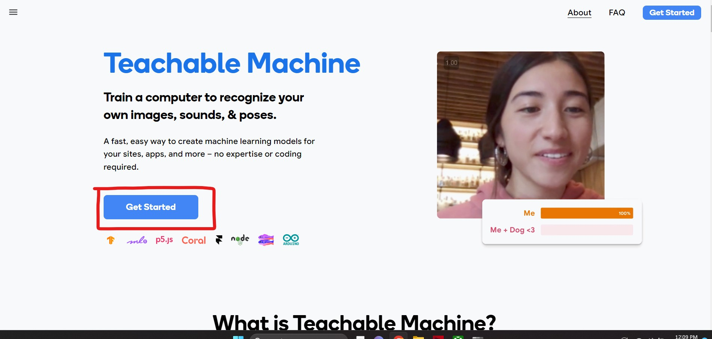
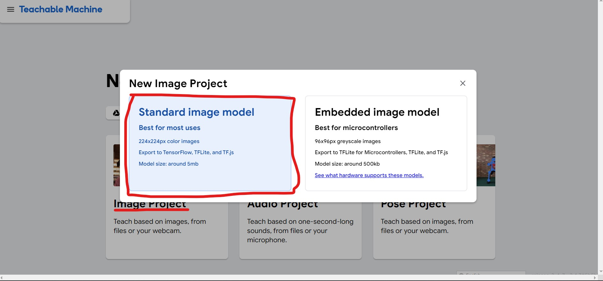
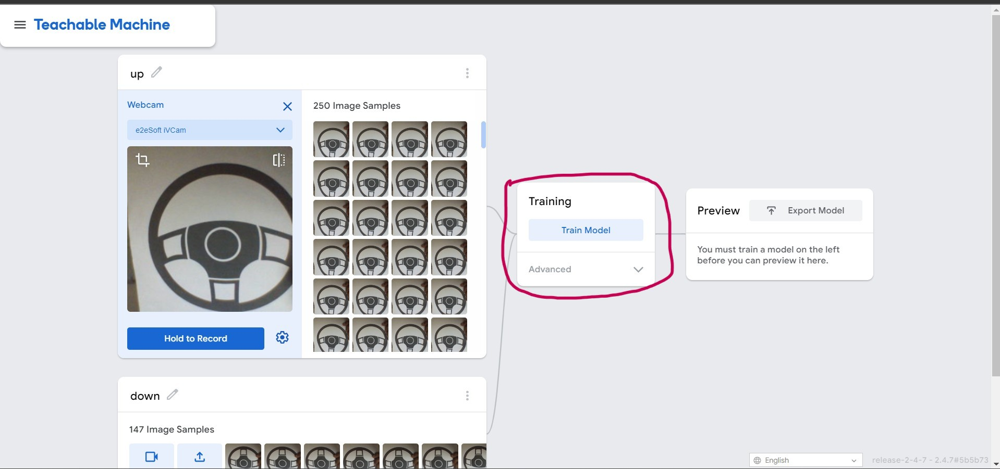

# ABCD Detector - Real-Time Alphabet Recognition System

<div align="center">


[](https://www.python.org/downloads/)
[](https://www.tensorflow.org/)
[](https://opencv.org/)
[](LICENSE)

**An AI-powered real-time alphabet detection system that recognizes letters A, B, C, and D using computer vision and machine learning.**

</div>

---

## 📋 Table of Contents

- [Overview](#-overview)
- [Features](#-features)
- [Technology Stack](#-technology-stack)
- [System Architecture](#-system-architecture)
- [Repository Structure](#-repository-structure)
- [Prerequisites](#-prerequisites)
- [Installation](#-installation)
- [Usage](#-usage)
- [How It Works](#-how-it-works)
- [Model Training](#-model-training)
- [Configuration](#-configuration)
- [Output Examples](#-output-examples)
- [Troubleshooting](#-troubleshooting)
- [Limitations](#-limitations)
- [Future Enhancements](#-future-enhancements)
- [Contributing](#-contributing)
- [License](#-license)
- [Contact](#-contact)

---

## 🎯 Overview

The **ABCD Detector** is an educational computer vision application that demonstrates real-time alphabet recognition using artificial intelligence. Built with TensorFlow and OpenCV, this application captures live video from your webcam, processes each frame through a trained neural network, and identifies the letters A, B, C, or D shown to the camera. The system provides both visual and audio feedback using text-to-speech technology.

### Purpose

This project serves as:
- **Educational Tool**: Learn about AI, computer vision, and machine learning concepts
- **Proof of Concept**: Demonstrate how low-code AI tools can be integrated into Python applications
- **Beginner-Friendly**: Show how to build an AI-powered application with minimal coding complexity
- **Foundation**: Serves as a starting point for more complex recognition systems

---

## ✨ Features

- ✅ **Real-Time Detection**: Processes webcam feed at ~1 FPS with live predictions
- ✅ **Audio Feedback**: Text-to-speech announces detected letters using female voice
- ✅ **Visual Display**: Live camera feed shown in OpenCV window
- ✅ **Pre-trained Model**: Includes ready-to-use Keras model trained on Teachable Machine
- ✅ **Simple Interface**: Easy-to-use with keyboard controls (ESC to exit)
- ✅ **Lightweight**: Minimal dependencies and fast inference
- ✅ **Cross-Platform**: Works on Windows, macOS, and Linux

---

## 🛠️ Technology Stack

### Core Technologies

| Technology | Version | Purpose |
|------------|---------|---------|
| **Python** | 3.8+ | Core programming language |
| **TensorFlow** | 2.x | Deep learning framework for model inference |
| **Keras** | (included in TensorFlow) | High-level neural networks API |
| **OpenCV** | 4.x | Computer vision library for video capture and processing |
| **Pyttsx3** | 2.x | Text-to-speech conversion library |
| **NumPy** | Latest | Numerical computing and array operations |

### AI Model

- **Model Type**: Convolutional Neural Network (CNN)
- **Training Platform**: Google Teachable Machine
- **Input Size**: 224x224x3 (RGB images)
- **Output Classes**: 4 (A, B, C, D)
- **Model Format**: Keras HDF5 (.h5)

---

## 🏗️ System Architecture

```
┌─────────────────┐
│   Webcam Input  │
└────────┬────────┘
         │
         ▼
┌─────────────────────────┐
│  OpenCV Video Capture   │
│  (640x480 → 224x224)    │
└────────┬────────────────┘
         │
         ▼
┌─────────────────────────┐
│  Image Preprocessing    │
│  - Resize to 224x224    │
│  - Normalize [-1, 1]    │
│  - Convert to array     │
└────────┬────────────────┘
         │
         ▼
┌─────────────────────────┐
│  Keras Model Inference  │
│  (keras_Model.h5)       │
└────────┬────────────────┘
         │
         ▼
┌─────────────────────────┐
│  Prediction Processing  │
│  - Get class index      │
│  - Calculate confidence │
│  - Extract label        │
└────────┬────────────────┘
         │
         ▼
┌─────────────────────────┐
│  Output                 │
│  - Display video        │
│  - Text-to-Speech (TTS) │
└─────────────────────────┘
```

---

## 📁 Repository Structure

```
abcd-detector/
│
├── docs/                           # Documentation and media files
│   ├── media/                      # Images and videos
│   │   ├── 0-banner-image.png     # Project banner
│   │   ├── 2-output-video.webm    # Demo video
│   │   ├── 3-tm-image.jpg         # Teachable Machine screenshot 1
│   │   ├── 4-tm-image.jpg         # Teachable Machine screenshot 2
│   │   └── 5-tm-image.jpg         # Teachable Machine screenshot 3
│   └── requirements.txt            # Python dependencies
│
├── research/                       # Experimental and research code
│   ├── main.py                     # Research version of the application
│   └── models/                     # Research models
│       ├── keras_model.h5         # Trained model file
│       └── labels.txt             # Class labels
│
├── soruce/                         # Main source code directory
│   ├── main.py                     # Primary application entry point
│   └── models/                     # Production models
│       ├── keras_model.h5         # Trained Keras model (10-20 MB)
│       └── labels.txt             # Class labels (A, B, C, D)
│
├── LICENSE                         # Project license (MIT)
└── README.MD                       # This file
```

**Note**: There is a typo in the source folder name (`soruce` instead of `source`). This is maintained for compatibility with existing setup.

---

## 📋 Prerequisites

Before installing the ABCD Detector, ensure your system meets these requirements:

### Hardware Requirements
- **Webcam**: Built-in or external USB camera
- **RAM**: Minimum 4GB (8GB recommended)
- **Storage**: ~500MB free space for dependencies and models
- **Processor**: Any modern CPU (GPU not required)

### Software Requirements
- **Python**: Version 3.8 or higher
- **pip**: Python package installer
- **Operating System**: Windows 10/11, macOS 10.14+, or Linux (Ubuntu 18.04+)
- **Webcam Drivers**: Properly configured and accessible

### Recommended
- Virtual environment (venv or conda)
- Updated graphics drivers
- Good lighting conditions for better detection accuracy

---

## 💻 Installation

Follow these steps to install and set up the ABCD Detector:

### Step 1: Clone the Repository

```bash
git clone https://github.com/mpowerrenterprise/abcd-detector.git
cd abcd-detector
```

### Step 2: Create a Virtual Environment (Recommended)

```bash
# Using venv
python -m venv venv

# Activate on Windows
venv\Scripts\activate

# Activate on macOS/Linux
source venv/bin/activate
```

### Step 3: Install Dependencies

Navigate to the `docs` directory and install required packages:

```bash
cd docs
pip install -r requirements.txt
```

**Dependencies installed:**
- `tensorflow` - Deep learning framework
- `keras` - Neural network API (included with TensorFlow 2.x)
- `opencv-python` - Computer vision library
- `pyttsx3` - Text-to-speech engine
- `numpy` - Numerical computing (installed with TensorFlow)

### Step 4: Verify Installation

```bash
python -c "import tensorflow as tf; import cv2; import pyttsx3; print('All dependencies installed successfully!')"
```

### Step 5: Test Webcam Access

```bash
python -c "import cv2; cap = cv2.VideoCapture(0); ret, frame = cap.read(); print('Webcam working!' if ret else 'Webcam error'); cap.release()"
```

---

## 🚀 Usage

### Quick Start

1. **Navigate to the source directory:**

```bash
cd ../soruce
```

2. **Run the application:**

```bash
python main.py
```

3. **Using the application:**
   - A window titled "ABCD Detector" will open showing your webcam feed
   - Hold up a card or paper with letters A, B, C, or D written on it
   - Position the letter clearly in front of the camera
   - The system will detect the letter and announce it via text-to-speech
   - Detection occurs approximately every second

4. **Exit the application:**
   - Press **ESC** key to close the application
   - The window will close and camera will be released

### Command-Line Options

Currently, the application runs with default settings. You can modify the code to change:

- Camera index (line 28): `camera = cv2.VideoCapture(0)` → change `0` to `1` or `2` for different cameras
- Detection interval (line 72): `time.sleep(1)` → adjust seconds between detections
- Voice settings (lines 13-16): Change speech rate and voice gender

---

## 🔍 How It Works

### Detailed Workflow

1. **Camera Initialization**
   ```python
   camera = cv2.VideoCapture(0)  # Opens default webcam
   ```

2. **Frame Capture**
   - Captures continuous frames from webcam at camera's native FPS
   - Creates a copy for display purposes

3. **Image Preprocessing**
   ```python
   # Resize to model's expected input size
   image = cv2.resize(image, (224, 224), interpolation=cv2.INTER_AREA)
   
   # Convert to float32 numpy array
   image = np.asarray(image, dtype=np.float32).reshape(1, 224, 224, 3)
   
   # Normalize pixel values from [0, 255] to [-1, 1]
   image = (image / 127.5) - 1
   ```

4. **Model Prediction**
   ```python
   prediction = model.predict(image)  # Get probability distribution
   index = np.argmax(prediction)      # Find class with highest probability
   confidence_score = prediction[0][index]  # Get confidence percentage
   ```

5. **Result Processing**
   - Extracts the predicted class label from `labels.txt`
   - Compares against known classes (a, b, c, d)
   - If confidence is sufficient, triggers text-to-speech

6. **Output Generation**
   - Displays live camera feed in OpenCV window
   - Announces detected letter using pyttsx3
   - Waits 1 second before next detection to avoid spam

7. **Exit Condition**
   - Monitors for ESC key press (ASCII 27)
   - Releases camera and destroys windows on exit

---

## 🎓 Model Training

### Training Your Own Model with Teachable Machine

The ABCD Detector uses a model trained with Google's Teachable Machine. Here's how to create your own:

#### Step 1: Access Teachable Machine

Visit [https://teachablemachine.withgoogle.com](https://teachablemachine.withgoogle.com)

#### Step 2: Start a New Project

Click **"Get Started"** button



#### Step 3: Select Project Type

- Choose **"Image Project"**
- Select **"Standard Image Model"**



#### Step 4: Create Classes

Create four classes with the following labels:
- Class 0: `a`
- Class 1: `b`
- Class 2: `c`
- Class 3: `d`

#### Step 5: Collect Training Data

For each class:
1. Use webcam to capture images (recommended: 100-200 images per class)
2. Vary conditions: different angles, lighting, handwriting styles
3. Include variations: printed letters, handwritten, different sizes
4. Ensure clear, focused images for better accuracy

**Tips for Better Data:**
- Use consistent background
- Maintain good lighting
- Include diverse samples
- Avoid blurry images
- Center the letter in frame

#### Step 6: Configure Training Settings



**Advanced Settings:**
- **Epochs**: 50 (higher = longer training, potentially better accuracy)
- **Batch size**: 16 (adjust based on dataset size)
- **Learning rate**: 0.001 (default works well)

#### Step 7: Train the Model

1. Click **"Train Model"** button
2. Wait for training to complete (2-10 minutes depending on data size)
3. Test the model using your webcam
4. Verify predictions are accurate

#### Step 8: Export the Model

1. Click **"Export Model"**
2. Select **"TensorFlow"** tab
3. Choose **"Keras"** format
4. Click **"Download my model"**
5. Extract the downloaded ZIP file

#### Step 9: Replace Model Files

Replace the existing model files in `soruce/models/`:
```bash
# Backup existing model
mv soruce/models/keras_model.h5 soruce/models/keras_model.h5.backup
mv soruce/models/labels.txt soruce/models/labels.txt.backup

# Copy new model
cp path/to/downloaded/keras_model.h5 soruce/models/keras_Model.h5
cp path/to/downloaded/labels.txt soruce/models/labels.txt
```

**Note**: The code expects `keras_Model.h5` (capital M) in the soruce folder.

---

## ⚙️ Configuration

### Modifying Voice Settings

Edit `soruce/main.py` to customize text-to-speech:

```python
# Change speech rate (words per minute)
engine.setProperty('rate', 90)  # Default: 90, Range: 50-200

# Change voice gender
voices = engine.getProperty('voices')
engine.setProperty('voice', voices[0].id)  # 0 = male, 1 = female
```

### Adjusting Detection Frequency

```python
# Change detection interval (in seconds)
time.sleep(1)  # Current: 1 second between detections
```

### Changing Camera Source

```python
# Use different camera
camera = cv2.VideoCapture(1)  # 0 = default, 1 = external, 2 = secondary
```

### Enabling Confidence Display

Uncomment lines 57-58 in `main.py` to print predictions:

```python
print("Class:", class_name[2:], end="")
print("Confidence Score:", str(np.round(confidence_score * 100))[:-2], "%")
```

---

## 📺 Output Examples

### Demo Video

Watch the ABCD Detector in action:

[2-output-video.webm](https://github.com/gunarakulangunaretnam/abcd-detector/assets/45822509/83205115-662d-4a41-83a2-b6ffba62e08f)

### Expected Behavior

When running the application:

1. **Webcam Window Opens**: Shows live camera feed
2. **Show Letter**: Hold a letter (A, B, C, or D) in front of camera
3. **Detection**: System recognizes the letter after ~1 second
4. **Audio Output**: Computer announces the detected letter
5. **Continuous**: Repeats detection every second
6. **Exit**: Press ESC to close

### Sample Output

```
Computer: A
Computer: B
Computer: C
Computer: D
```

---

## 🔧 Troubleshooting

### Common Issues and Solutions

#### 1. Camera Not Found

**Error**: `Cannot open camera`

**Solutions**:
- Verify webcam is connected and working
- Check if another application is using the camera
- Try different camera index: `cv2.VideoCapture(1)` or `cv2.VideoCapture(2)`
- On Linux, check permissions: `sudo usermod -a -G video $USER`

#### 2. No Audio Output

**Error**: Text-to-speech not working

**Solutions**:
- **Windows**: Ensure SAPI5 voices are installed
- **macOS**: Check System Preferences → Accessibility → Speech
- **Linux**: Install espeak: `sudo apt-get install espeak`
- Verify audio output device is working

#### 3. Low Detection Accuracy

**Problem**: Wrong letters detected or no detection

**Solutions**:
- Improve lighting conditions
- Use clearer, larger letters
- Ensure letter is centered in frame
- Hold letter steady for 1-2 seconds
- Retrain model with more diverse data
- Check if letter matches training data style

#### 4. Model Not Found

**Error**: `FileNotFoundError: models/keras_Model.h5`

**Solutions**:
- Verify you're in the `soruce/` directory
- Check model file exists: `ls models/`
- Ensure correct filename: `keras_Model.h5` (capital M)
- Restore from research folder if needed

#### 5. Import Errors

**Error**: `ModuleNotFoundError: No module named 'cv2'`

**Solutions**:
- Ensure virtual environment is activated
- Reinstall dependencies: `pip install -r docs/requirements.txt`
- Check Python version: `python --version` (should be 3.8+)

#### 6. TensorFlow Warnings

**Warning**: TensorFlow logs and warnings

**Solutions**:
- Suppress warnings by adding to top of `main.py`:
  ```python
  import os
  os.environ['TF_CPP_MIN_LOG_LEVEL'] = '2'
  ```
- Update TensorFlow: `pip install --upgrade tensorflow`

#### 7. Slow Performance

**Problem**: Low FPS or laggy video

**Solutions**:
- Reduce detection frequency: increase `time.sleep(1)` to `time.sleep(2)`
- Close other applications
- Use smaller camera resolution
- Upgrade Python packages

---

## ⚠️ Limitations

### Current Limitations

1. **Limited Character Set**: Only recognizes letters A, B, C, D
   - Does not recognize other alphabets or numbers
   - Case-insensitive (treats uppercase and lowercase the same)

2. **Detection Accuracy**: 
   - Dependent on training data quality
   - Requires good lighting conditions
   - May struggle with unusual fonts or handwriting styles
   - Not suitable for production or critical applications

3. **Performance**:
   - Detection delay of ~1 second between predictions
   - Not optimized for real-time continuous tracking
   - CPU-based inference (no GPU acceleration configured)

4. **Teachable Machine Constraints**:
   - Simple model architecture (not state-of-the-art)
   - Limited customization options
   - Best for educational purposes, not enterprise use

5. **Platform-Specific Issues**:
   - Text-to-speech voice availability varies by OS
   - Webcam compatibility may differ across systems
   - Some Linux distributions require additional setup

6. **No Confidence Threshold**:
   - Always announces a letter even with low confidence
   - No mechanism to reject uncertain predictions

---

## 🚀 Future Enhancements

### Planned Improvements

- [ ] **Expand Character Set**: Add recognition for complete alphabet (A-Z)
- [ ] **Number Recognition**: Include digits 0-9
- [ ] **Confidence Display**: Show confidence scores on screen
- [ ] **GUI Interface**: Create user-friendly graphical interface
- [ ] **Adjustable Threshold**: Allow users to set minimum confidence level
- [ ] **Multiple Detection**: Recognize multiple letters simultaneously
- [ ] **Performance Optimization**: Add GPU support and faster inference
- [ ] **Model Export**: Support for TensorFlow Lite for mobile deployment
- [ ] **Recording Feature**: Save detected letters to text file
- [ ] **Advanced Models**: Use more sophisticated architectures (ResNet, EfficientNet)

### How to Contribute Ideas

If you have suggestions for improvements:
1. Open an issue on GitHub
2. Describe your enhancement idea
3. Explain the use case and benefits
4. Provide examples if applicable

---

## 🤝 Contributing

Contributions are welcome! Here's how you can help:

### Ways to Contribute

1. **Report Bugs**: Open an issue describing the bug and steps to reproduce
2. **Suggest Features**: Propose new features or improvements
3. **Improve Documentation**: Fix typos, add examples, clarify instructions
4. **Submit Code**: Create pull requests with bug fixes or new features
5. **Share Models**: Share improved trained models
6. **Test**: Test on different platforms and report compatibility

### Contribution Guidelines

1. **Fork the Repository**
   ```bash
   git clone https://github.com/your-username/abcd-detector.git
   ```

2. **Create a Feature Branch**
   ```bash
   git checkout -b feature/your-feature-name
   ```

3. **Make Changes**
   - Follow existing code style
   - Add comments for complex logic
   - Test thoroughly before committing

4. **Commit Changes**
   ```bash
   git add .
   git commit -m "Add: Description of your changes"
   ```

5. **Push to GitHub**
   ```bash
   git push origin feature/your-feature-name
   ```

6. **Create Pull Request**
   - Describe your changes
   - Reference related issues
   - Wait for review

### Code Style

- Follow PEP 8 for Python code
- Use meaningful variable names
- Add docstrings to functions
- Keep functions focused and concise

---

## 📄 License

This project is licensed under the **MIT License** - see the [LICENSE](LICENSE) file for details.

### MIT License Summary

- ✅ Commercial use allowed
- ✅ Modification allowed
- ✅ Distribution allowed
- ✅ Private use allowed
- ❌ No liability
- ❌ No warranty

---

## 📞 Contact

### Developer: Gunarakulan Gunaretnam

#### Website

[](https://www.gunarakulan.info)

#### Social Media

[](https://www.linkedin.com/in/gunarakulangunaretnam)
[](https://www.facebook.com/gunarakulangunaretnam)
[](https://wa.me/94740001141?text=WhatsApp%3A%20%2B9740001141)
[](https://www.instagram.com/gunarakulangunaretnam)
[](https://x.com/gunarakulangr)
[](https://www.kaggle.com/gunarakulangr)
[](https://www.tiktok.com/@gunarakulangunaretnam)
[](https://www.youtube.com/channel/UCjMOdgHFAjAdBKiqV8y2Tww)

---

## 🙏 Acknowledgments

- **Google Teachable Machine** - For providing an accessible AI training platform
- **TensorFlow Team** - For the powerful deep learning framework
- **OpenCV Community** - For the comprehensive computer vision library
- **Python Community** - For the excellent ecosystem and tools

---

## 📚 Additional Resources

### Learn More About

- [TensorFlow Documentation](https://www.tensorflow.org/tutorials)
- [OpenCV Tutorials](https://docs.opencv.org/master/d9/df8/tutorial_root.html)
- [Keras Guide](https://keras.io/guides/)
- [Google Teachable Machine](https://teachablemachine.withgoogle.com/)
- [Computer Vision Basics](https://docs.opencv.org/4.x/d9/df8/tutorial_root.html)

### Related Projects

- [Full Alphabet Recognition Systems](https://github.com/topics/alphabet-recognition)
- [Hand Gesture Recognition](https://github.com/topics/gesture-recognition)
- [Object Detection Projects](https://github.com/topics/object-detection)

---

<div align="center">

**Made with ❤️ for education and learning**

⭐ **Star this repository if you find it helpful!** ⭐

</div>
